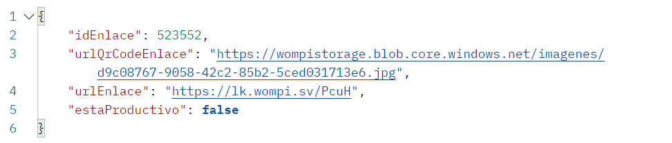

# WOMPI Y POSTMAN

Conectamos una pasarela de pagos con wompi la cual unicamente se nos habilito la opción de Enlace de pago para poder realizar la compra ​ ​&#x20;

TOKEN Y AUTORIZACIÓN

Petición ​ ​&#x20;

<figure><figcaption></figcaption></figure>

Respuesta ​ ​&#x20;

<figure><figcaption></figcaption></figure>

Petición para regiones donde se podra usar

<figure><figcaption></figcaption></figure>

Respuestas

<figure><figcaption></figcaption></figure>

Aplicativo Petición

<figure><figcaption></figcaption></figure>

Respuesta

<figure><figcaption></figcaption></figure>

Enlace de págo

Body

<figure><figcaption></figcaption></figure>

Header

<figure><figcaption></figcaption></figure>

Respuesta

<figure><figcaption></figcaption></figure>
